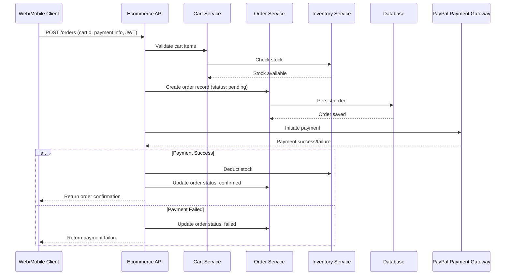

# Ecommerce API (Secure, Scalable, Modular Backend)

🔗 [GitHub Repo](https://github.com/COZYTECH/ecommerce-API)

A **RESTful Ecommerce Backend API** built with **Express.js and Node.js**, designed for production use with **modular architecture, authentication, authorization, transactional integrity, and PayPal payment integration**.

---

<p align="center">
  
</p>

---

## 🚀 Executive Summary

This API provides a **production-grade backend** for ecommerce platforms with:

* **User authentication & role-based access control**
* **Product catalog management**
* **Cart & order workflows**
* **PayPal payment integration**
* **Transactional integrity with inventory checks**
* **Extensible, modular service-layer design**
* **Production-ready error handling & logging**

It demonstrates **senior-level engineering practices**, including layered architecture, secure workflows, and production-ready deployment considerations.

---

## 🧠 Architecture Overview

The backend uses **modular layering**:

```
src/
  ├── controllers/      # HTTP request handling
  ├── services/         # Business logic & transactional workflows
  ├── routes/           # API routing
  ├── middleware/       # Auth, validation, error handling
  ├── models/           # ORM / schema definitions
  ├── utils/            # Shared utilities (logging, helpers)
  └── app.js            # Application bootstrap
```

**Benefits:**

* Testable service layer
* Clear separation of concerns
* Easy extension for new modules or microservices

---

## 🛠 Core API Features

### 🔐 Authentication & Authorization

* User registration and login
* JWT token issuance
* Role-based access (customer, admin)
* Protected routes for sensitive operations

### 📦 Product Management

* CRUD for products
* Product categorization and filtering
* Inventory tracking

### 🛒 Cart & Order Management

* Cart creation and item management
* Order creation from cart
* Transaction-safe workflows with inventory adjustments
* Order state transitions: pending → confirmed → shipped → delivered

### 💳 PayPal Payment Integration

* Payment initiation endpoint
* Payment confirmation webhook handling
* Transaction validation before order confirmation

---

## 🔄 Sequence Diagram: Order Creation + PayPal Payment



---

### 📐 Architecture Diagram

Ecommerce Order Flow

> **Description:**
>
> * Client (Web/Mobile) → HTTP → Express.js API
> * JWT Authentication
> * Controllers → Services → Database
> * PayPal Payment Gateway integrated for checkout
> * Middleware handles security & validation
> * Services handle business logic & transactional consistency

---

## 🔑 Security Model

* JWT authentication with role validation
* Passwords hashed using bcrypt
* CSRF-safe patterns (stateless)
* Authorization middleware on sensitive routes
* Input validation and structured error handling

---

## 🧪 Error Handling Strategy

* Centralized error middleware
* Structured error output
* Appropriate HTTP status codes
* No stack traces in production

Example:

```json
{
  "error": "Insufficient stock for product id",
  "status": 400,
  "details": ["Product quantity exceeds available inventory"]
}
```

---

## 📦 Tech Stack

**Backend**

* Node.js + Express.js
* JWT Authentication
* bcrypt

**Database**

* MySQL / PostgreSQL

**Infrastructure**

* PM2 / Cluster mode
* Nginx (reverse proxy)
* Optional Redis for caching

---

## ⚙ Environment Setup (.env)

```
PORT=5000
DB_URI=your_database_connection_string
JWT_SECRET=your_super_secret_key
NODE_ENV=development
PAYPAL_CLIENT_ID=your_paypal_client_id
PAYPAL_SECRET=your_paypal_secret
```

---

## 🚀 Local Development

```bash
git clone https://github.com/COZYTECH/ecommerce-API
cd ecommerce-API
npm install
npm run dev
```

Server runs at `http://localhost:5000`.

---

## 🏗 Production Readiness

* Stateless, modular design → cluster-ready
* Transaction-safe order & inventory flows
* PayPal integration for production payment handling
* Optimistic cart validation with error handling
* Secure authentication & authorization
* Layered service architecture for maintainability

---

## ⏭ Future Enhancements

* Pagination & filtering for products
* Rate limiting / anti-fraud measures
* Order history and user dashboards
* Cart expiration logic
* Webhooks for analytics or external systems
* Redis caching for product catalog endpoints
* Swagger/OpenAPI documentation
* CI/CD pipelines for automated deployment

---

## 🤝 Engineering Decisions

* **Service-layer separation:** enables testing & maintainability
* **JWT authentication:** stateless & horizontally scalable
* **Transactional workflows:** ensures data consistency with inventory & payment
* **PayPal integration:** allows seamless real-world checkout
* **Modular routing:** simplifies adding new resources (discounts, shipping, etc.)

---

## 👤 Author

**Arigi Adinoyi Samuel**
Senior Backend & Full-Stack | DevOps Engineer
GitHub: [cozytech](https://github.com/cozytech)

Portfolio: *(optional)*

